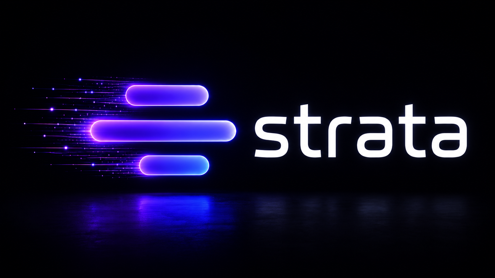

  

<h1 align="center">Strata</h1>

  <strong>Real-time staging telemetry for Laravel teams.</strong>

  See requests, queries, jobs, scheduled tasks, and staging issues while QA
  testers, clients, and developers use the environment.

---

## Status

Strata is in foundation planning. Application code has not been written yet.

This repository is being prepared first so the project starts with clear
standards, documentation, security expectations, and product direction.

## What Strata Will Do

Strata is planned as a real-time staging telemetry dashboard for Laravel teams.
It will help teams observe what happens inside a staging environment while real
people interact with it.

Planned telemetry areas:

- HTTP requests
- database queries
- slow queries
- N+1 query patterns
- queued jobs
- failed jobs
- scheduled tasks
- exceptions and warnings
- deployment and environment context

## Who It Is For

Strata is for Laravel teams that need staging feedback during QA, client review,
internal demos, and pre-release validation.

It should help:

- developers find issues quickly
- QA testers report behavior with better context
- technical leads understand staging health
- clients review work without needing local dev tools
- teams reduce "works on my machine" ambiguity

## Product Principles

- Make staging behavior visible.
- Keep sensitive data out by default.
- Prefer clear timelines over noisy dashboards.
- Make issue context easy to share.
- Treat documentation as part of the product.
- Optimize for correctness and trust before performance polish.

## Repository Contents

- [Brand Assets](assets/brand)
- [Roadmap](ROADMAP.md)
- [Changelog](CHANGELOG.md)
- [Contributing](CONTRIBUTING.md)
- [Security](SECURITY.md)
- [Support](SUPPORT.md)
- [Product Brief](docs/product-brief.md)
- [Telemetry Scope](docs/telemetry-scope.md)
- [Privacy and Security](docs/privacy-security.md)
- [Architecture Principles](docs/architecture-principles.md)
- [Compatibility](docs/compatibility.md)
- [Storage and Retention](docs/storage-retention.md)
- [Definition of Done](docs/definition-of-done.md)

## Development

There is no Strata application code yet.

When implementation begins, this README should be updated with:

- installation instructions
- local development setup
- package structure
- environment variables
- testing commands
- deployment notes

## License

Copyright (c) 2026 Nerrowake.

All rights reserved. Product licensing should be finalized before application
code is published.
